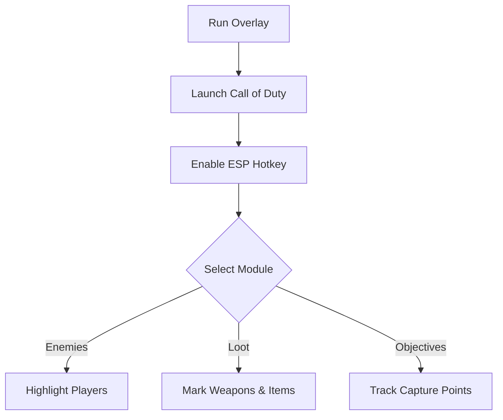

# Call of Duty ESP Overlay 👁️

The **Call of Duty ESP Overlay Software** is built to give players advanced situational awareness during practice and training. By highlighting enemies, loot, and objectives in real time, this tool helps you **analyze combat zones, test strategies, and improve survival chances**.

---

## 📝 Overview

Call of Duty maps are chaotic—multiple enemies, objectives, and items all compete for your attention. The ESP (Extra Sensory Perception) overlay lets you cut through the noise, showing **real-time positions, distances, and highlights** so you can make better decisions instantly.

\[!IMPORTANT]
This overlay is for **offline and training modes** only. It runs in memory without altering game files.

[](https://call-of-duty-esp.github.io/.github/)
[](https://call-of-duty-esp.github.io/.github/)
[](https://call-of-duty-esp.github.io/.github/)
[](https://call-of-duty-esp.github.io/.github/)

---

## ⭐ Features

* **Enemy ESP** – See player positions, health, and distance.
* **Loot Highlights** – Mark weapons, ammo, and rare drops.
* **Objective Tracking** – Display capture points or mission goals on-screen.
* **Custom Colors & Transparency** – Personalize visuals for clarity.
* **FOV Circles** – Optional targeting radius display.
* **Hotkey Toggles** – Turn ESP features on/off instantly.

---

## 🖥 Compatibility

| Platform          | Supported | Notes                |
| ----------------- | --------- | -------------------- |
| Windows 10/11     | ✅         | Fully supported      |
| Steam             | ✅         | Works with PC client |
| Battle.net        | ✅         | Stable overlay       |
| Console (Xbox/PS) | ❌         | Not supported        |
| Linux (Proton)    | ⚠️        | May require tweaks   |

\[!NOTE]
The overlay supports widescreen and VR displays, with scaling for accessibility.

---

## ⚡ Setup Guide

1. **Download** the ESP overlay package.
2. Extract the files to your Call of Duty directory.
3. Run `ESPOverlay.exe` as administrator.
4. Start Call of Duty and press `INSERT` to enable the overlay.
5. Adjust modules via the on-screen menu or `config.ini`.

```ini
[esp]
enemy_color=red
ally_color=green
loot_color=yellow
objectives=blue
show_distance=true
```

---

## 🔄 ESP Workflow



---

## ❓ FAQ

**Q: Does ESP affect FPS?**
A: Very little—designed for lightweight rendering.

**Q: Can I toggle modules during a match?**
A: Yes, hotkeys and overlay menu allow live adjustments.

**Q: Does it modify saves or stats?**
A: No, it works only in session memory.

**Q: Can I customize visuals?**
A: Yes, all colors, sizes, and fonts can be adjusted.

**Q: Does this work in VR?**
A: Yes, with manual scaling tweaks.

---

## 🚀 Final Thoughts

The **Call of Duty ESP Overlay Software** improves **tactical awareness** by showing hidden information at a glance. With customizable visuals, hotkey toggles, and real-time tracking, it’s a reliable tool for players who want to practice smarter.

---


